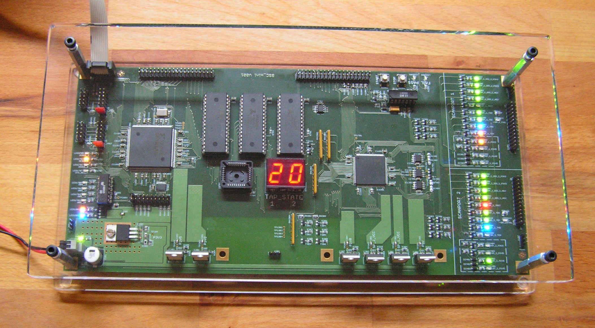

# SYSTEM M-1
## An OpenSource Boundary Scan Test System (JTAG / IEEE1149.x) for:
- design checking
- low level hardware testing and repairing
- detection of opens, shorts, misloaded parts
- bring-up of prototypes and systems
- system testing in the field

### Test Pattern Generators and UUT data structures open for:
- interaction with In-Circuit and Flying Probe Test
- interaction optical inspection (AOI/AXI)
- customer specific requirements and extensions

### Special Features
- highly scripting capable
- files ASCII based and well suitable for version control with git
- programming language to write test programs
- runs natively on Linux
- source code written in Ada (for mission critical applications)
- rugged boundary scan controller hardware for industrial and educational purposes

### Boundary Scan Controller OpenSource:

- the boundary scan controller for training, development and education:

### Why Ada ??
- The only programming language that provides a robust and strong typing system is Ada.
- Objects and structures within such a test system are very complex things and require sound modelling.
- If saftey/mission critical and military applications use Ada, then is must be good for such a system as well.
- Ada is defined by ISO/IEC 8652:2012 and MIL-STD-1815
- Ada is beautiful :-)

### More Download Stuff
- find training material and user manual at http://www.blunk-electronic.de/products.html

### Collaboration
- We need a nice web site for the project.
- You are highly welcome !
